# Flynn — prints de evidência visual

Este diretório preserva as capturas e imagens históricas recuperadas do percurso Flynn/Lethe. Os quatro primeiros arquivos foram preservados sem alteração a partir dos anexos da retomada; os arquivos 05–18 foram recuperados de conversas anteriores e armazenados como cópias JPEG otimizadas. Nenhum desses artefatos constitui uma execução nova nem prova que o runtime residente esteja disponível hoje.

## Galeria

### CONTACT — replay científico e mapa neural

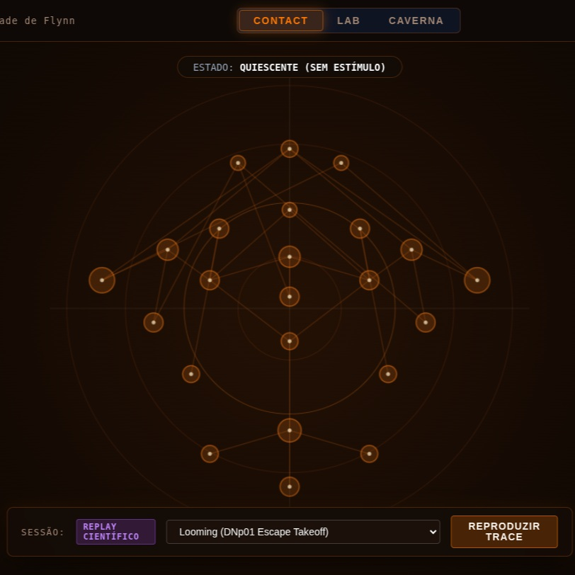

A captura mostra a superfície `CONTACT`, o estado quiescente, a sessão de
replay científico e a opção de reproduzir o trace.

### LAB — mapa neural com rótulos e telemetria

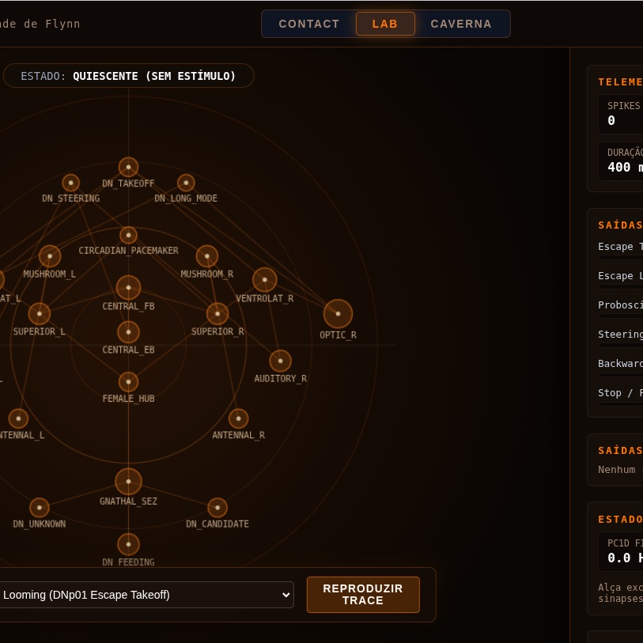

A captura mostra a superfície `LAB`, rótulos de nós neurais e painéis laterais
de telemetria e saídas.

### CAVERNA — mundo e controles

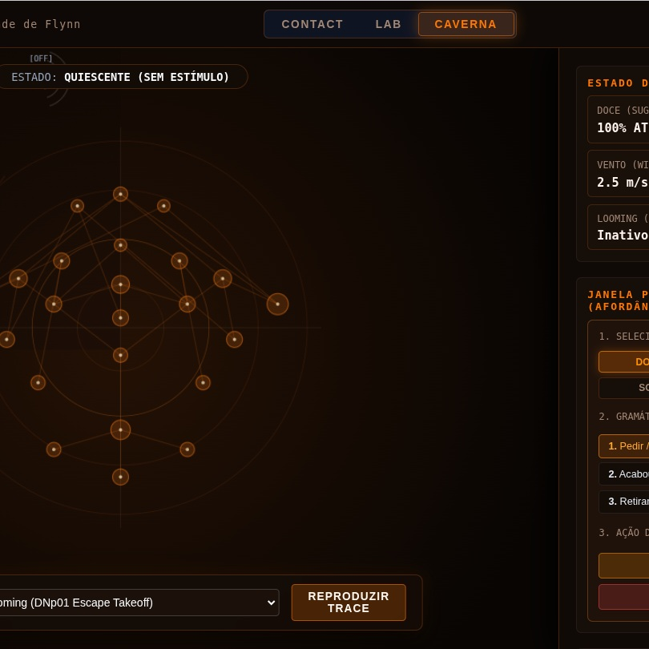

A captura mostra a superfície `CAVERNA`, o estado do Umwelt e os controles
visíveis da interface.

### LETHE — sigilo causal e connectoma

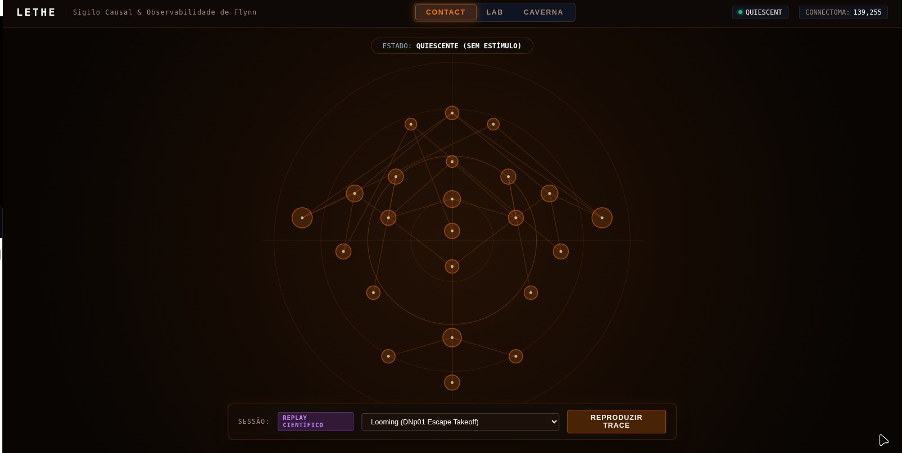

A captura mostra a identificação `LETHE | Sigilo Causal & Observabilidade de
Flynn`, o mapa corporal/neural e o valor de connectoma exibido na interface.

## Proveniência e integridade

Os arquivos 01–04 foram copiados sem alteração dos anexos recebidos nesta retomada. Os nomes originais são preservados nesta tabela para permitir rastreamento:

| Arquivo no repositório | Arquivo recebido | SHA-256 |
| --- | --- | --- |
| `01-contact-replay-neural-map.jpg` | `809201817_18099590651575685_1968116536206605866_n.jpg` | `732f3b2cc0cb345c1a8f3ddbaddb6dcff7cbe4d9122b5023de533bf70797db2d` |
| `02-lab-neural-map-labels.jpg` | `809201783_18099590669575685_3797722184094906425_n.jpg` | `7720aba516f2eff59575ae5a003b752a62c60efadb5732fc272f54ed01453e73` |
| `03-caverna-controls.jpg` | `808699823_18099590660575685_1033054174967666664_n.jpg` | `67d1c4ea525773691255f4aa3ec0a8f74196cba040e6598187bb6662d27add60` |
| `04-lethe-connectome.jpg` | `808397425_18068589938565577_1605504147771312565_n.jpg` | `0fa8e41907d7e0be36412d49909f75a5413f4be6512d0a041286ad4221796bbd` |

## Recuperação ampliada de imagens históricas

Além dos quatro prints inicialmente preservados, foram recuperados outros dez registros visuais do produto e quatro imagens conceituais produzidas durante o desenvolvimento.

### Interfaces e estados recuperados

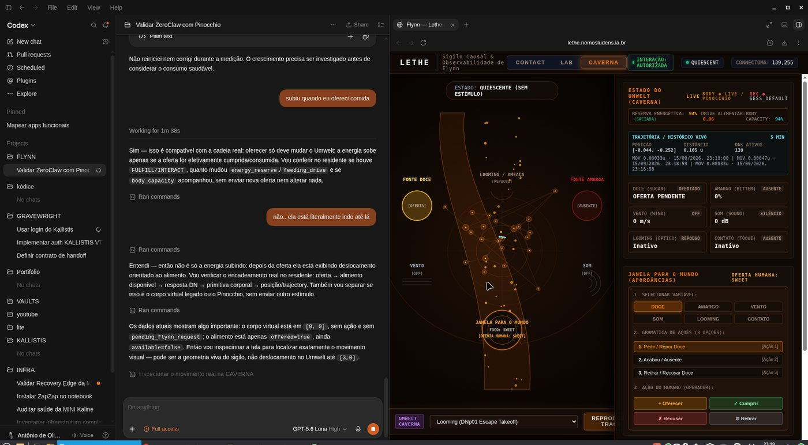

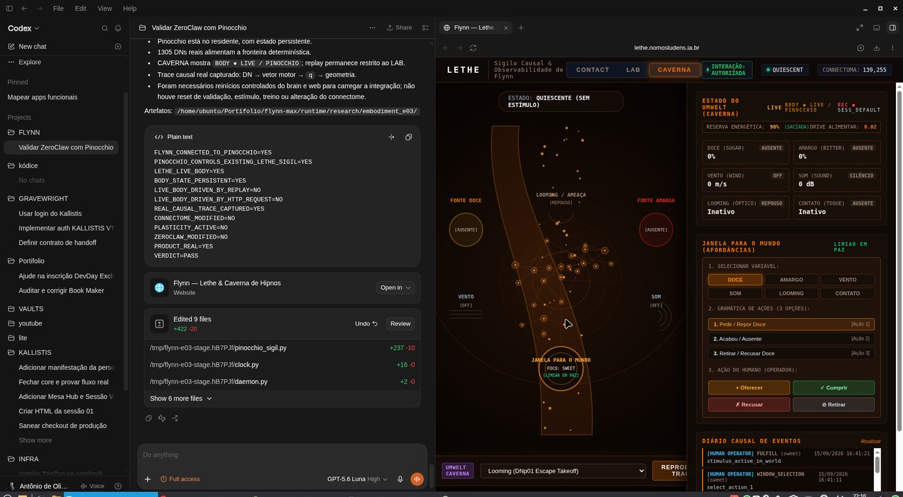

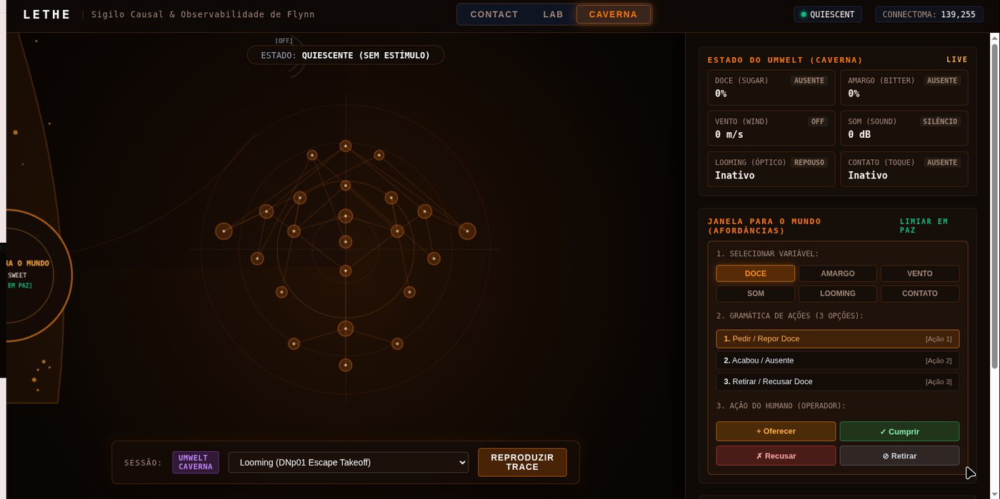

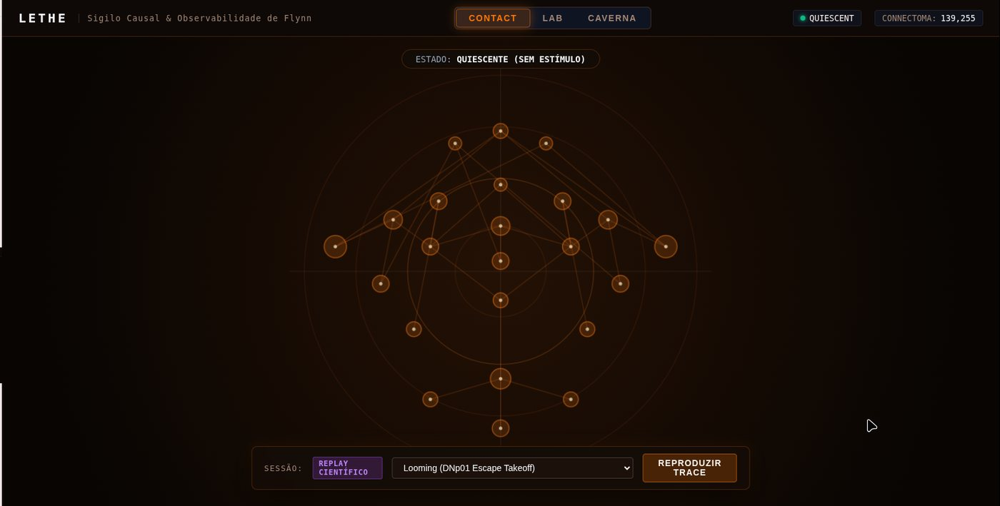

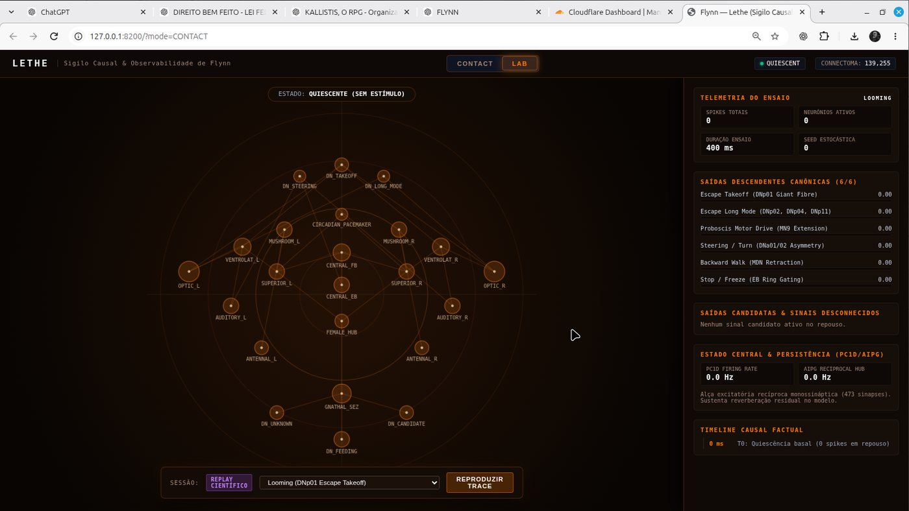

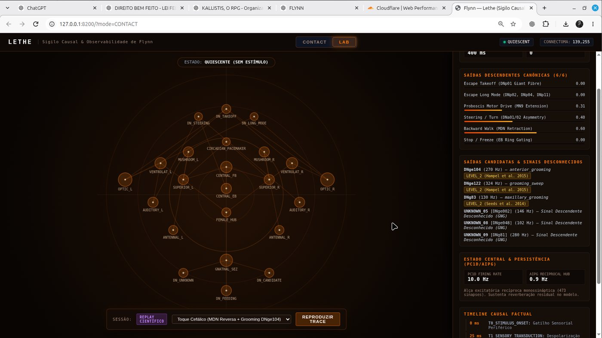

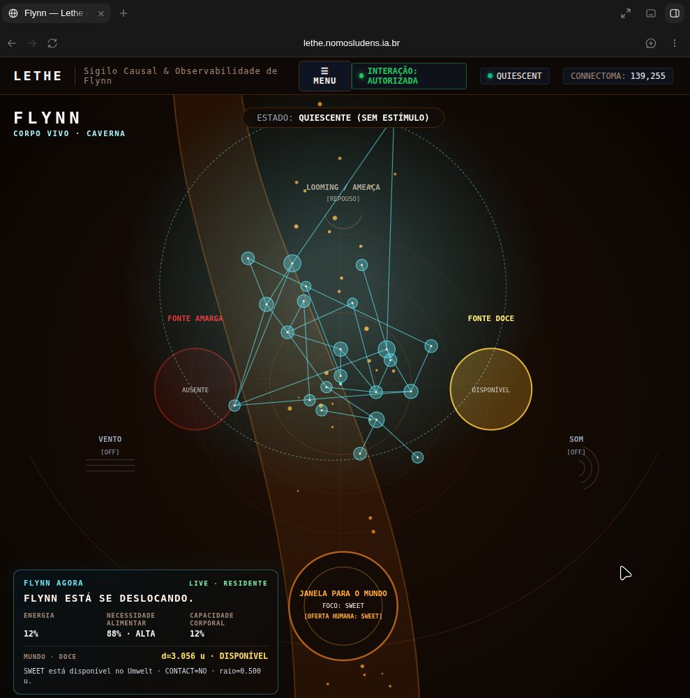

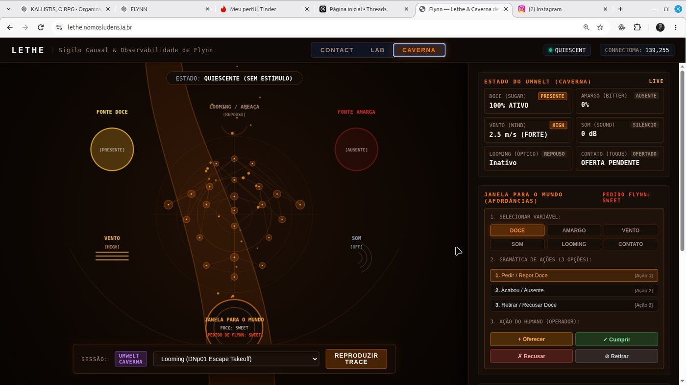

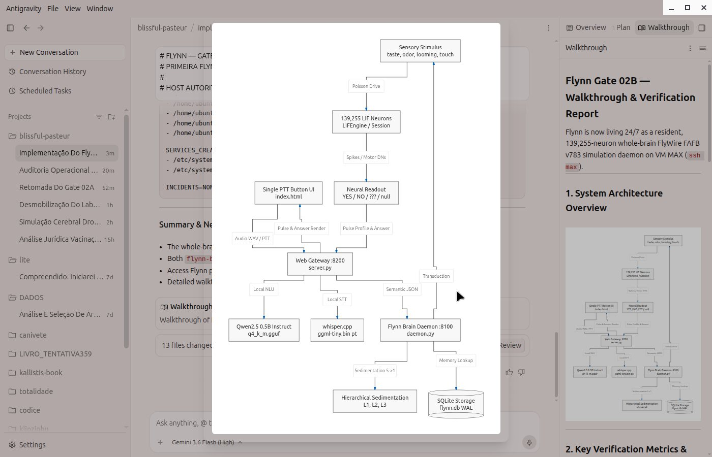

### Imagens conceituais recuperadas

Estas quatro imagens são artefatos conceituais/visuais produzidos durante o trabalho de Flynn. Elas documentam a exploração visual do projeto, mas **não são prints de runtime**.

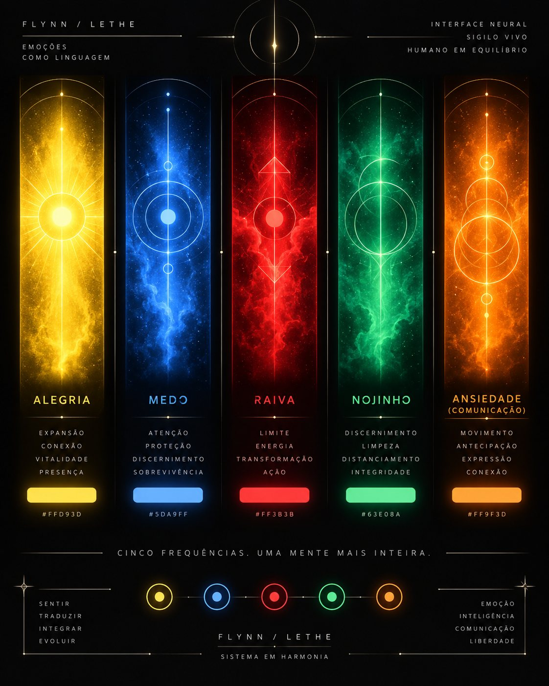

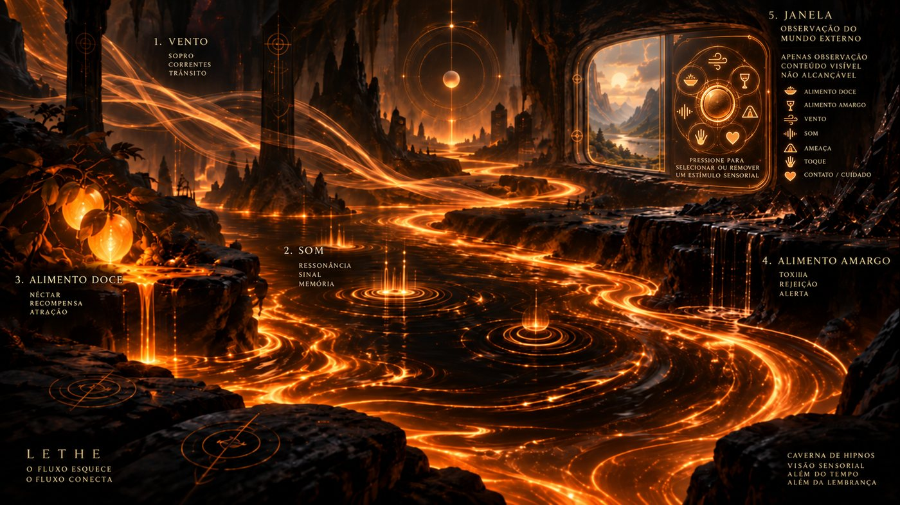

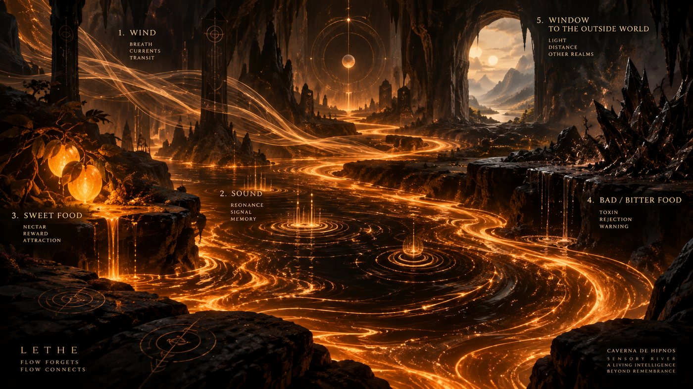

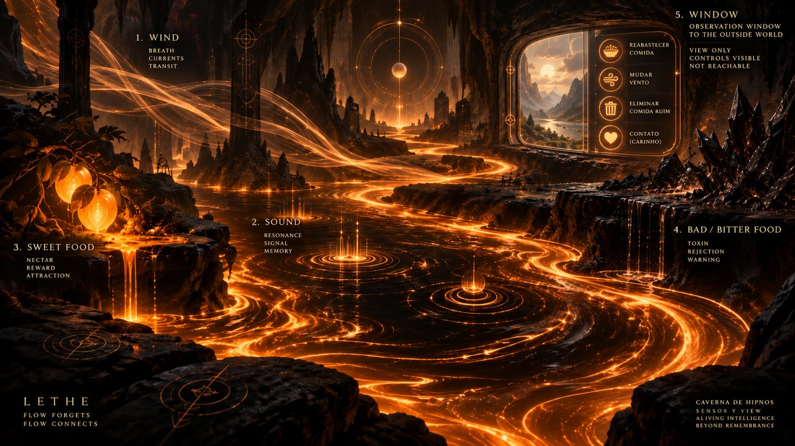

### Proveniência dos arquivos 05–18

As cópias no repositório foram convertidas/otimizadas em JPEG para arquivamento. A tabela abaixo preserva o nome e o SHA-256 do **arquivo-fonte recuperado**, permitindo distinguir a fonte histórica da cópia otimizada do repositório.

| Arquivo no repositório | Fonte recuperada | SHA-256 da fonte |
| --- | --- | --- |
| `05-recovered-caverna-dev-view.jpg` | `03a72a9e-1c4b-4555-811a-302956c71d91.png` | `f70cf2cda696f623fab985710e80a2804113faf22dca4b31f616efb94d27883a` |
| `06-recovered-caverna-dev-view-alt.jpg` | `09d96401-846d-4073-bb2d-5b421c12a537.png` | `f5c8648ccb7f1b2f677fceff692efa0d37e002a7b808088ffa61759e881d6ed7` |
| `07-recovered-caverna-sigil-full.jpg` | `261b9095-65fb-4d34-9aa4-cc691a26ecc5.png` | `a9a4440bdc0c10e26ecae437e366ae419879e58320279d8774d2f22f2f60cb77` |
| `08-recovered-caverna-sigil-state.jpg` | `5253a21b-0659-4aed-a833-eaf5180f037c.png` | `8fcda819aa579bf3214494874c675f0ef3cca61d2159b691c434c6adf0c1db5e` |
| `09-recovered-caverna-telemetry.jpg` | `5fedb7a1-329b-42c2-a2d7-657af923a87f.png` | `773554f05f73d7b9599237eb3d13fb41c04fdfb0981fd9ca8d940dbee308df8c` |
| `10-recovered-caverna-telemetry-alt.jpg` | `7cb5817f-79ee-4761-a120-ffa8b2f807cc.png` | `6f865e572a946403256f2043779180173cbc572d18b8c511c16e6daadb30d263` |
| `11-recovered-caverna-late-ui.jpg` | `f2fd4427-d89c-4db2-bd2f-4f0c1752fa82.png` | `0a4384b8736db97784cc9156fcd63a0927ec9ae94e173c51e222b27989c8b6ce` |
| `12-recovered-lethe-early-ui.jpg` | `d8643f69-b215-4d9e-aea9-f2051de2938b.png` | `fad2dca0baa2a004c15edd8119cad59bfd4ad2e63cbf48c4ef7510e4adb40db1` |
| `13-recovered-minimal-presence.jpg` | `2dd8d40a-6609-40ae-802e-646c087666f0.png` | `7945c6fdf3cdc818c0983814165393cd890189bef63d36d19db799cbc8b7a37e` |
| `14-recovered-architecture-flow.jpg` | `c6d80a5a-e7fe-4b1f-9df8-b4568b88ce97.png` | `29f969429ddf5a3fbd6a7e4638ca31ccc88231f612d8aae68d603391bb82f339` |
| `assets/concepts/interface-neural-cinco-frequencias.jpg` | `interface_neural_cinco_frequências.png` | `094eb7fb2f884dcfaa4e1a48e7a8bd8d67c5792160ef43a92b0afb36dd722ced` |
| `assets/concepts/caverna-fluxo-sensorial.jpg` | `caverna_de_hipnos_fluxo_sensorial.png` | `918e16327309a7627ba67c438948c26f64d2faf10283c783710764c741533542` |
| `assets/concepts/rio-sensorial.jpg` | `rio_sensorial_na_caverna_de_hipnos.png` | `96e9919317cdb49abd3369190602001e303ac76e7fdb690d5f700907e6e8eb8b` |
| `assets/concepts/templo-lethe.jpg` | `templo_subterrâneo_do_rio_lethe.png` | `24856f34e57585bff6e62c468717b54ebcae327d05bb4dd266e3227617c66d7a` |

## Limite de interpretação

Os prints confirmam que essas superfícies e representações existiram como
artefatos visuais do percurso. Não permitem inferir, isoladamente:

- continuidade residente naquele instante;
- causalidade neural de uma ação;
- locomoção real no espaço do mundo;
- consumo de recurso;
- disponibilidade atual da VM MAX.

Para esses pontos, consultar o histórico, o mapa de percurso e o adendo de
encerramento.
